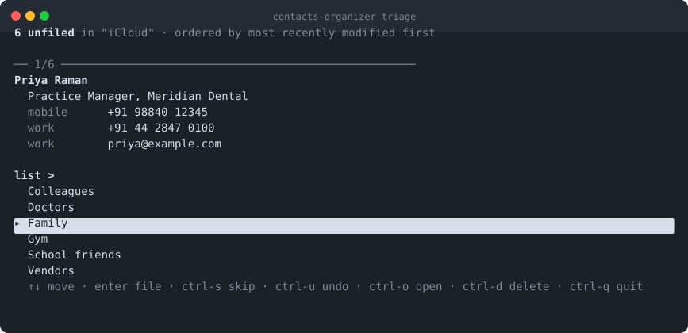

# contacts-organizer


Files unsorted iCloud contacts into lists, from the terminal.



Contacts that belong to no group are treated as an inbox: the tool walks them
one at a time, shows the record, and lists your existing lists. Arrow to the one
you want — or type to filter — and the contact is filed. Re-run whenever new
contacts have piled up.

Only the **iCloud** account is touched. Google, Exchange and "On My Mac"
contacts are ignored — macOS cannot reliably edit their groups.

## Install

```sh
swift build -c release
ln -sf "$PWD/.build/release/contacts-organizer" ~/.local/bin/contacts-organizer
```

`~/.local/bin` is already on PATH. The symlink points at the build output, so a
later `swift build -c release` is the whole update process.

No runtime dependencies.

## Permissions

macOS grants Contacts access to the **terminal app**, not to this binary. The
first run prompts; approve it. If it was denied before, no prompt appears —
switch the terminal on under System Settings → Privacy & Security → Contacts,
or run `tccutil reset AddressBook` to clear the old decision.

## Usage

```
contacts-organizer            # triage (default)
contacts-organizer stats      # total / filed / unfiled, and per-list counts
contacts-organizer lists      # the lists in your iCloud account
contacts-organizer audit      # contacts that ended up in more than one list
contacts-organizer doctor     # diagnose permissions, account and date matching
contacts-organizer help
```

`--container <id>` picks a specific account if you have several CardDAV ones;
`stats` prints the identifiers.

### Triage keys

| Key | Action |
|---|---|
| `↑` `↓` | Move the highlight. `ctrl-p` / `ctrl-n` also work. |
| *type* | Filter the lists as you type, ranked exact → prefix → substring, so `work` puts *Work* above *Workshop*. |
| `enter` | File into the highlighted list. If nothing matches what you typed, it offers to create that list. |
| `ctrl-s` | Skip. Nothing is written, so it reappears on the next run. |
| `ctrl-u` | Undo the last assignment and re-show that contact. |
| `ctrl-o` | Open the contact in Contacts.app. |
| `ctrl-d` | Delete the contact. Confirmed separately — this syncs to every device and cannot be undone. |
| `ctrl-q` `esc` | Quit. Each assignment is saved as it happens, so nothing is lost. |

Over a pipe, or on a terminal that cannot do raw mode, it falls back to a
numbered prompt: a number, or text to match, `enter` to skip, `:q` to quit,
`:?` for help. `CONTACTS_ORGANIZER_SIMPLE=1` forces that mode.

## Tests

```sh
swift test
```

38 tests, no fixtures and no terminal required. The parts that decide
behaviour are kept as pure value logic so they can be driven directly:

- **`KeyDecoderTests`** — arrow keys in both normal and application cursor
  mode, escape sequences split across reads, a lone ESC, control keys, and
  partial UTF-8.
- **`PickerModelTests`** — filter ranking, highlight wrap-around, and the
  create-on-no-match path.
- **`RedrawTests`** — replays the emitted escape sequences through a small
  terminal simulator to assert that consecutive frames start on the same
  screen row and that no row is wide enough to wrap. Both of those were real
  bugs: the frame used to walk up the screen on every keystroke.
- **`LinePickerTests`** — drives the fallback picker by pointing stdin at a
  file, including end-of-input.
- **`QueueBuilderTests`** — the definition of "unfiled", and the ordering
  fallback when no modification date matches.

Nothing here touches the Contacts store, so the suite runs without the
Contacts permission and cannot modify an address book.

## Design notes

The screenshot above is generated from the program's real output — the same
`Render.card` and `InteractivePicker.frame` the tool runs — with invented list
and contact names. No real address-book data goes into the repository.

- **One list per contact.** The queue is by definition "contacts in no list", so
  each filed contact lands in exactly one, and the prompt accepts a single
  choice. Use `audit` to catch anything that drifted via Contacts.app or the
  phone.
- **Two pickers, one of them dependency-free by design.** The arrow-key picker
  uses raw mode; the line picker needs no terminal at all and takes over
  automatically when stdin or stdout is not a tty. Key decoding and filtering
  are pure value logic, so both are tested by feeding them bytes rather than
  driving a terminal.
- **The redraw is one write, and every row is clipped to the terminal width.**
  A row that wraps occupies two terminal lines that the cursor arithmetic
  cannot see, which makes each redraw walk up the screen. Rows erase only
  their own tail as they are rewritten rather than blanking the block first,
  and the whole frame is wrapped in a synchronized update (DEC 2026), so
  nothing flickers. `InteractivePicker.frame` returns the frame instead of
  writing it, so a small terminal simulator asserts that consecutive frames
  start on the same row and that no row reaches the terminal width.
- **The terminal is always put back.** Raw mode is restored via `defer`, an
  `atexit` hook, and handlers for SIGTERM/SIGHUP/SIGQUIT, so a killed process
  cannot leave the shell without an echo or a cursor.
- **No state file.** Skipped contacts come back next run, by design. The only
  state is what is in iCloud.
- **Ordering** is most-recently-modified first. `CNContact` has no public
  modification date, so the dates are read (read-only) from the AddressBook
  Core Data stores. That schema is undocumented; if it stops matching, the tool
  says so and falls back to alphabetical.
- **Notes are not shown.** `CNContactNoteKey` has needed an Apple-granted
  entitlement since macOS 11, and asking for it makes the fetch throw.
